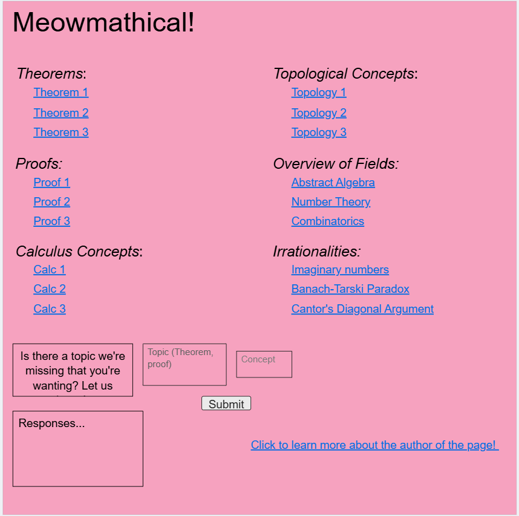
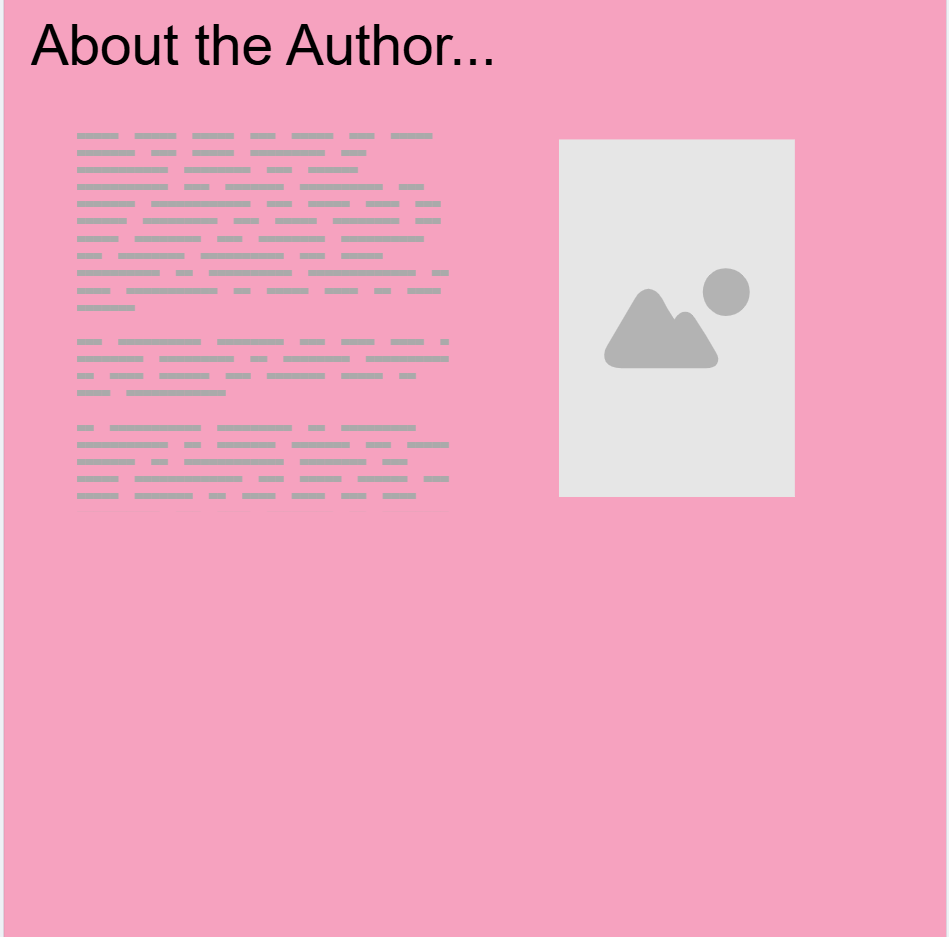
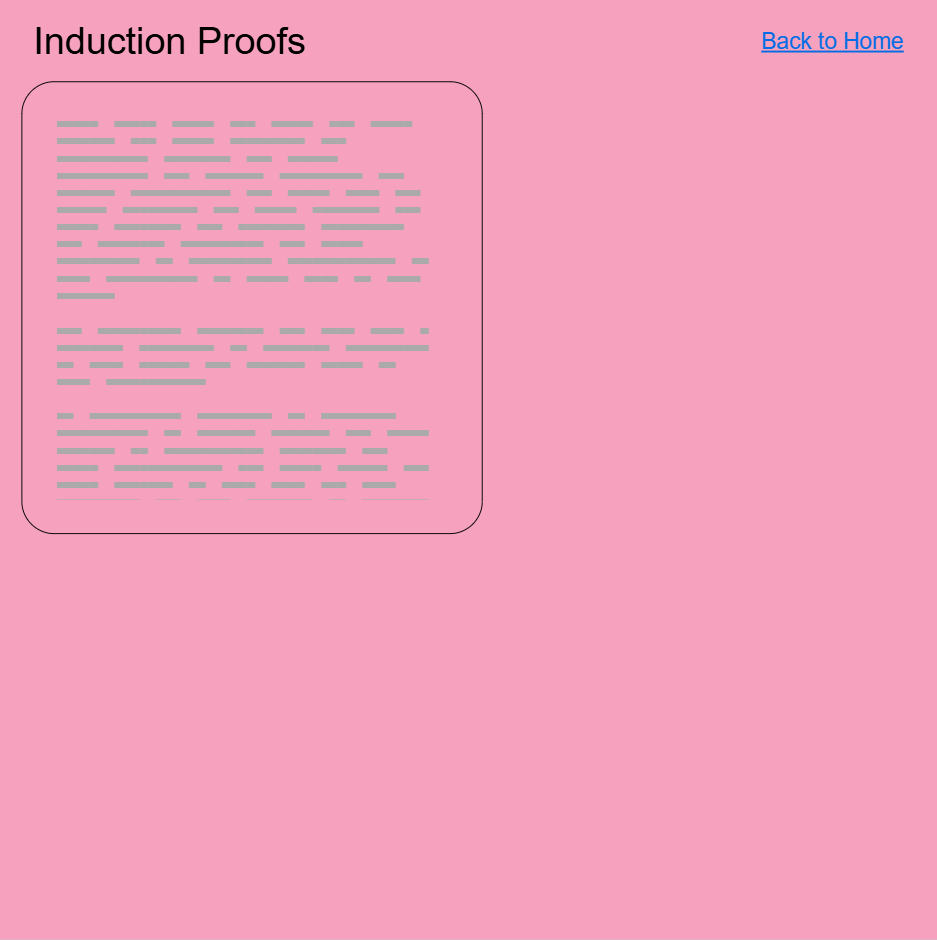

# Web Dev Starter Code

## Project Spec

For this final project, I would love to create something that resembles that of a math forum. It would consist of different umbrella terms that leads into different concepts in math that you want to read more about. As a computer science student, I don't really get a chance to talk about some different math concepts, so this would be a great place for me to do so. The home page with the directory of the different concepts would serve as the landing page. It wuold include user input where a person could enter a comment asking for a certain topic to be discussed if it's not already on there. So, the only data my website would handle would be that of user input through text. This would also be where I incorporate my API with the PUT, GET, and DELETE methods. These would be super useful in formatting the comments sent in by users. I would format that data into a table where it is sorted by its umbrella term like a type of proof or a theorem or a calculus concept, and then the specified concept under that category. Each concept is a hyperlink to its own page. At the bottom I will also have a link to an about me page, if people wanted to know more about who made the website. I would just introduce myself, and overtime if I wanted to really make it cool, I could add a questions box that is sent to my email or something. 

Each page for the concepts would consists of text, maybe some images. They would just be a general overview of the concept, why I think of it or why I like it. This wasn't in my mockup, but I would like to add a section on each page that serves as a comment section. People can share their thoughts on the page, particularly about the concept. 

I didn't include this in my mockup, but I think it would also be fun to add a section that has recommendations for math. This includes podcasts or books about math that I found enjoyable and would recommend to the general audience.

As you could have probably guessed, this site would be targeted towards other students, but especially other people that love math and enjoy looking at different areas in math in their free time. This is a nice site because I'm able to add on features easily as time goes on. I can add on different concepts or areas and as I'm typing this out, I'm thinking of bonus features I could add. The site is sort of cat-themed; it's called Meowmatical (mathmatical). I love cats, so I thought it was obvious that I had to think of something lighthearted for that. This would also be a nice opportunity to work with different API's. I could possibly find a free API that works with LaTeX, so I could embed that into my website. LaTeX is a language meant for math, so it would be perfect, and great experience.  

## Project Wireframe

## Sources 

https://www.w3schools.com/howto/tryit.asp?filename=tryhow_css_two_columns 

https://www.w3schools.com/tags/tag_input.asp

https://www.khanacademy.org/computing/computer-science/cryptography/modarithmetic/a/what-is-modular-arithmetic

https://blog.mattclemente.com/2019/07/12/modulus-operator-modulo-operation/

https://www.khanacademy.org/computing/computer-science/cryptography/modarithmetic/a/congruence-modulo

https://exploringnumbertheory.wordpress.com/2013/07/08/fermats-little-theorem-and-rsa-algorithm/

https://www.davidmaiolo.com/2024/03/10/exploring-impact-fermats-little-theorem-cryptography/